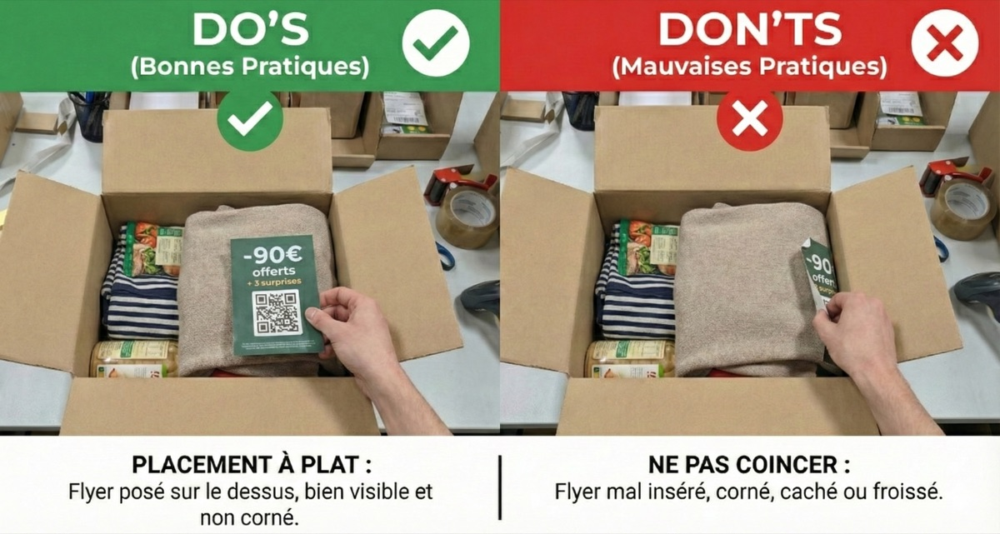

---
layout: default
title: Logistique & Insertion
parent: "Sponsored Mail "
grand_parent: Espace Distributeurs
nav_order: 1
---

# Opérations Logistiques
{: .fs-9 }

De la réception des palettes à l'expérience d'ouverture client (Unboxing).
{: .fs-6 .fw-300 }

<h2 class="text-purple-200 mb-4">1. Réception des supports</h2>

<!-- ETAPE 1 -->

 
1

 

 <h3 class="mt-0 text-grey-dk-000">Contrôle à l'arrivée</h3>
 
Les supports (flyers, échantillons) sont livrés à l'adresse de votre entrepôt renseignée sur la plateforme.

 <ul>
 <li>Vérifiez l'état des palettes et des cartons.</li>
 <li>Vérifiez que la quantité correspond au bon de livraison (BL).</li>
 </ul>
 

<!-- ETAPE 2 -->

 

   <svg xmlns="http://www.w3.org/2000/svg" width="20" height="20" viewBox="0 0 24 24" fill="none" stroke="currentColor" stroke-width="2" stroke-linecap="round" stroke-linejoin="round"><path d="M20 6 9 17l-5-5"/></svg>
 

 

 <h3 class="mt-0 text-green-200">Confirmation de Réception</h3>
 
<strong>Action obligatoire :</strong> Connectez-vous sur <a href="https://app.getinside.media/">app.getinside.media</a> et cliquez sur <strong>"Valider la réception"</strong>.

 
Cela notifie l'Annonceur que la marchandise est bien arrivée et prête à être distribuée.

 

 <strong>Attention : Problème de livraison ?</strong> 
 Si les supports sont endommagés, prenez des photos et signalez-le immédiatement à <a href="mailto:logistique@getinside.fr">logistique@getinside.fr</a> avant toute distribution.

<h2 class="text-purple-200 mb-4">2. Bonnes pratiques d'insertion</h2>

La valeur du Sponsored Mail repose sur l'expérience d'ouverture. Pour garantir la satisfaction de l'Annonceur, respectez ces règles d'or.

<h3 class="text-green-200"> La Règle du "On-Top"</h3>

Le support publicitaire doit impérativement être déposé <strong>sur les produits</strong>, face visible. Il doit être la première chose que le client voit.

<!-- IMAGE DO / DON'T -->

 <!-- Remplacez le nom du fichier ci-dessous par le vôtre si différent -->
 

 
 

 <h4 class="mt-0" style="display: flex; align-items: center; gap: 8px;">
   <svg xmlns="http://www.w3.org/2000/svg" width="20" height="20" viewBox="0 0 24 24" fill="none" stroke="currentColor" stroke-width="2" stroke-linecap="round" stroke-linejoin="round"><path d="M14.5 2H6a2 2 0 0 0-2 2v16a2 2 0 0 0 2 2h12a2 2 0 0 0 2-2V7.5L14.5 2z"/><polyline points="14 2 14 8 20 8"/><line x1="16" x2="8" y1="13" y2="13"/><line x1="16" x2="8" y1="17" y2="17"/><line x1="10" x2="8" y1="9" y2="9"/></svg>
   Gestion de la facture
 </h4>
 
Si vous insérez un BL ou une facture papier : placez l'offre <strong>au-dessus</strong>. Elle ne doit jamais être cachée à l'intérieur d'un document plié.

 

 

 <h4 class="mt-0" style="display: flex; align-items: center; gap: 8px;">
   <svg xmlns="http://www.w3.org/2000/svg" width="20" height="20" viewBox="0 0 24 24" fill="none" stroke="currentColor" stroke-width="2" stroke-linecap="round" stroke-linejoin="round"><path d="M12 22s8-4 8-10V5l-8-3-8 3v7c0 6 8 10 8 10Z"/></svg>
   Exclusions & Qualité
 </h4>
 <ul class="mb-0 fs-3 pl-4">
 <li><strong>Concurrence :</strong> Jamais deux offres concurrentes dans le même colis.</li>
 <li><strong>État :</strong> Ne pas insérer de flyer froissé ou corné.</li>
 </ul>
 

<h2 class="text-purple-200 mb-4">3. Stockage</h2>

Les supports doivent être stockés dans un endroit sec et propre (à l'abri de l'humidité et de la poussière) pour éviter toute détérioration avant insertion.
