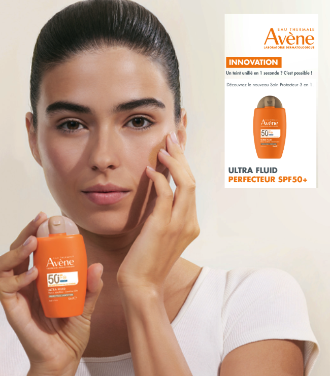
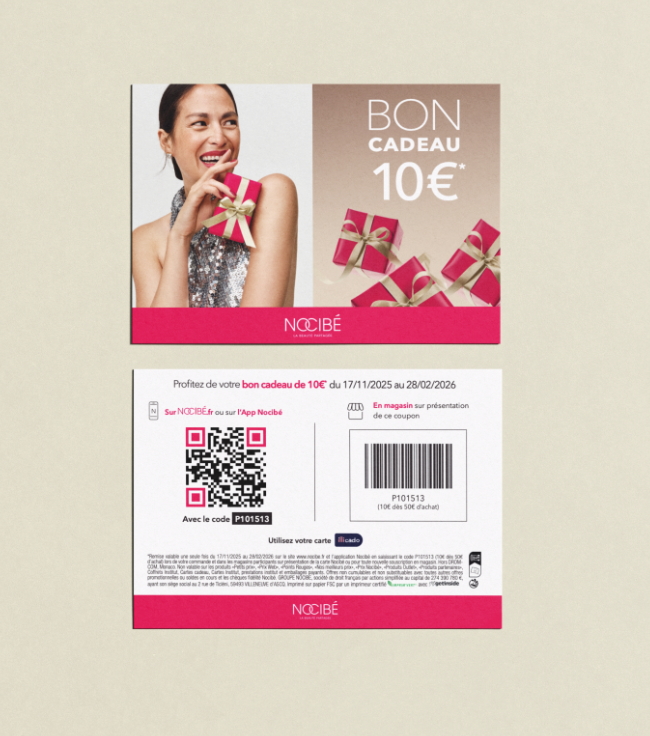
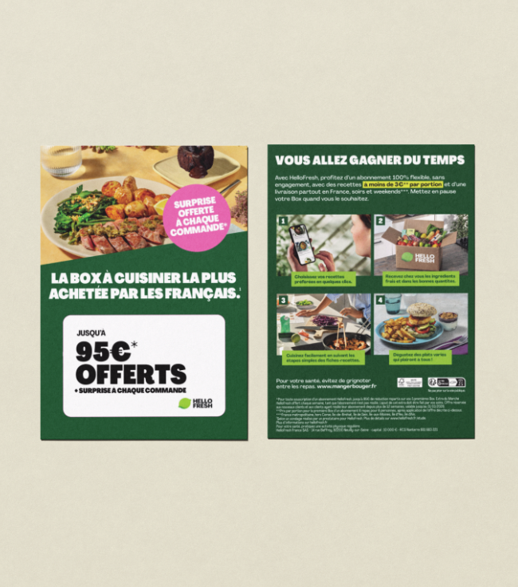
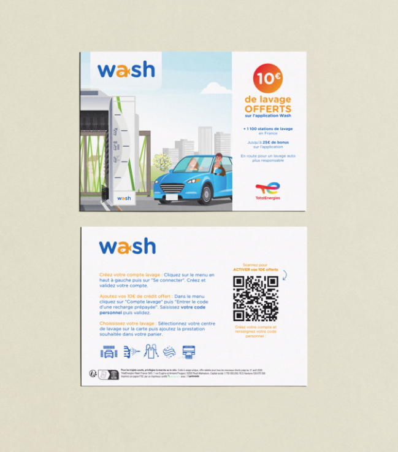
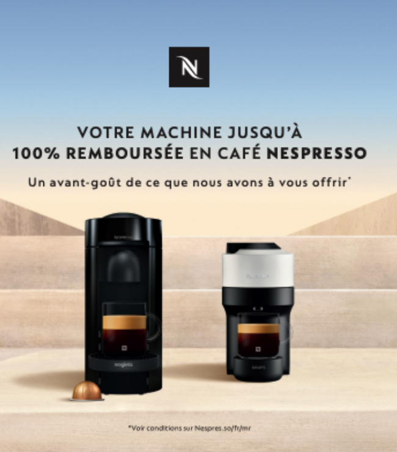
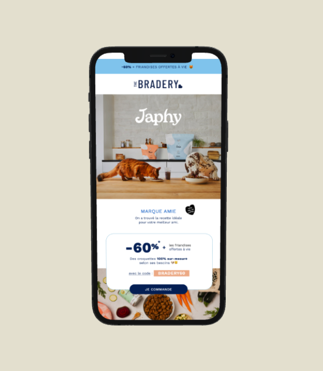

# Inspirations & Case Studies
{: .fs-9 }

Découvrez comment d'autres marques utilisent getinside pour atteindre leurs objectifs d'acquisition.
{: .fs-6 .fw-300 }

  <a href="https://app.getinside.media/" target="_blank" class="btn btn-primary fs-4">Créer ma campagne</a>

<!-- 1. CAS AVÈNE -->

  
  <!-- COLONNE IMAGE (Portrait) -->
  

    <!-- Remplacer le src par votre image : ../../../../assets/images/case-avene.jpg -->
    
  

  <!-- COLONNE CONTENU -->
  

    

      <h2 class="mt-0 mb-0">AVÈNE</h2>
      Notoriété
    

    
    
Développer la notoriété et générer du trafic

    
    

    
    

      

        <strong class="d-block fs-2 text-grey-dk-000">Format</strong>
        Asile Colis (Échantillon)
      

      

        <strong class="d-block fs-2 text-grey-dk-000">Ciblage</strong>
        Beauté, Santé & Bien-être
      

      

        <strong class="d-block fs-2 text-grey-dk-000">Volume</strong>
        30 000 ex.
      

      

        <strong class="d-block fs-2 text-grey-dk-000">Interaction</strong>
        5,40%
      

    

    

      “Des opérations de campagnes externalisées et une campagne clé en main.”
    

  

<!-- 2. CAS NOCIBÉ -->

  
  

    
  

  

    

      <h2 class="mt-0 mb-0">NOCIBÉ</h2>
      Omnicanal
    

    
    
Générer des conversions en ligne et en magasin (Drive-to-Store).

    
    

    
    

      

        <strong class="d-block fs-2 text-grey-dk-000">Mécanique</strong>
        Code Unique + Code Barre
      

      

        <strong class="d-block fs-2 text-grey-dk-000">Audience</strong>
        Mode & Accessoires
      

      

        <strong class="d-block fs-2 text-grey-dk-000">ROI</strong>
        16:1
      

      

        <strong class="d-block fs-2 text-grey-dk-000">Acquisition</strong>
        20% nouveaux clients
      

    

    

      “Une campagne omnicanale qui a su réconcilier le on et le off line.”
    

  

<!-- 3. CAS HELLO FRESH -->

  
  

    
  

  

    

      <h2 class="mt-0 mb-0">HELLO FRESH</h2>
      Acquisition
    

    
    
Recruter de nouveaux clients à l'échelle (Scale).

    
    

    
    

      

        <strong class="d-block fs-2 text-grey-dk-000">Fréquence</strong>
        25 campagnes / mois
      

      

        <strong class="d-block fs-2 text-grey-dk-000">Top Audiences</strong>
        Petfood, Famille, Cadeaux
      

      

        <strong class="d-block fs-2 text-grey-dk-000">Offre</strong>
        Carte Cadeau
      

      

        <strong class="d-block fs-2 text-grey-dk-000">Conversion</strong>
        1% CVR moyen
      

    

    

      “Une stratégie nous permettant de tester toutes les audiences et de constituer un historique.”
    

  

<!-- 4. CAS TOTAL WASH -->

  
  

    
  

  

    

      <h2 class="mt-0 mb-0">TOTAL WASH</h2>
      Drive to App
    

    
    
Faire télécharger l'application et acquérir de nouveaux clients.

    
    

    
    

      

        <strong class="d-block fs-2 text-grey-dk-000">Volume</strong>
        300 000 ex.
      

      

        <strong class="d-block fs-2 text-grey-dk-000">Ciblage</strong>
        Auto-Moto
      

      

        <strong class="d-block fs-2 text-grey-dk-000">Clics (CTR)</strong>
        12%
      

      

        <strong class="d-block fs-2 text-grey-dk-000">Coût Acquisition</strong>
        8,7€ CAC
      

    

    

      “Plus de 70% de nouveaux clients recrutés grâce à ce canal.”
    

  

<!-- 5. CAS NESPRESSO -->

  
  

    
  

  

    

      <h2 class="mt-0 mb-0">NESPRESSO</h2>
      Trade Marketing
    

    
    
Développer la collaboration avec les distributeurs (Boulanger).

    
    

    
    

      

        <strong class="d-block fs-2 text-grey-dk-000">Partenaire</strong>
        Boulanger
      

      

        <strong class="d-block fs-2 text-grey-dk-000">Format</strong>
        Carte Code Unique + Code Barre
      

      

        <strong class="d-block fs-2 text-grey-dk-000">Volume</strong>
        48 000 ex.
      

      

        <strong class="d-block fs-2 text-grey-dk-000">Interaction</strong>
        2,25%
      

    

    

      “De nouveaux inventaires médias pour activer des audiences consommateurs clairement identifiées.”
    

  

<!-- 6. CAS JAPHY -->

  
  <!-- COLONNE IMAGE (Portrait) -->
  

    <!-- Remplacer le src par votre image : ../../../../assets/images/case-avene.jpg -->
    
  

  <!-- COLONNE CONTENU -->
  

    

      <h2 class="mt-0 mb-0">JAPHY</h2>
      Notoriété
    

    
    
Faire découvrir et tester un nouveau produit (Sampling).

    
    

    
    

      

        <strong class="d-block fs-2 text-grey-dk-000">Format</strong>
        e-mail dédié
      

      

        <strong class="d-block fs-2 text-grey-dk-000">Audience</strong>
        The bradery
      

      

        <strong class="d-block fs-2 text-grey-dk-000">Volume</strong>
        200 000 contacts.
      

      

        <strong class="d-block fs-2 text-grey-dk-000">Interaction</strong>
        1,90%
      

    

    

      "Une campagne efficace qui fait connaître la marque et bénéficie de l’image de The Bradery pour un CPM très accessible"
    

  

