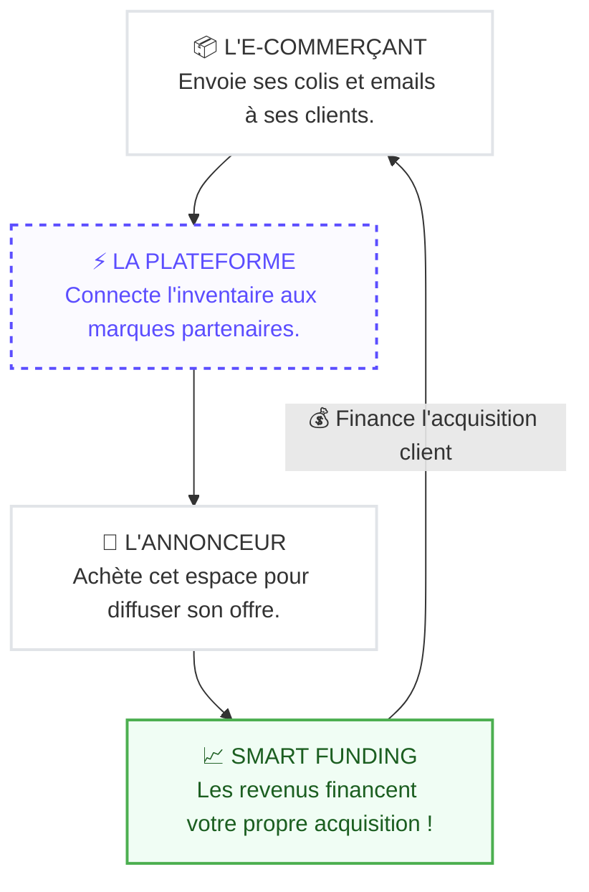

# Comment ça fonctionne ?

Du fonctionnement opérationnel aux leviers de performance : comprendre l'écosystème getinside.

## Le Transfert de Confiance (Endorsement)

Le point commun entre un colis, une newsletter et un post social d'une marque :

- **La Relation Client :** Le consommateur a déjà acheté ou s'est abonné volontairement.
- **La Crédibilité :** Il fait confiance à l'éditeur (le e-commerçant).
- **L'Attention :** Il attend ce contenu (suivi de commande, nouveautés).

  <strong>L'Effet de Halo</strong>
  
En vous insérant dans cet écosystème, votre marque bénéficie instantanément de ce capital confiance. Vous n'êtes plus un intrus, vous êtes un <strong>partenaire recommandé</strong>.

## Pour l'E-commerçant : La logique économique

  <strong>Le cercle vertueux du Réinvestissement</strong>
  
getinside n'est pas seulement une régie, c'est un accélérateur de croissance.

  

    

      <strong>1. Monétisation</strong>
      
Vos colis et emails génèrent du cash grâce aux annonceurs tiers.

    

    

      <strong>2. Transfert Instantané</strong>
      
Vos revenus sont disponibles sur votre Wallet. Pas besoin d'attendre un virement bancaire.

    

    

      <strong>3. Acquisition</strong>
      
Vous réinvestissez ce budget pour diffuser VOS campagnes chez des partenaires complémentaires.

    

  

  
<em>Résultat : Vous financez votre acquisition client... grâce à vos propres colis !</em>

## 3 Leviers, 1 Écosystème

Ne laissez aucun asset inexploité. getinside valorise vos points de contact physiques et digitaux pour maximiser la couverture.

  

    📦
    

      <strong>Asile Colis</strong>
      
Force : <strong>Attention (100%)</strong>. Rôle : Ancrage mémoriel, prise en main physique, conversion.

    

  

  

    📧
    

      <strong>Emailing Dédié</strong>
      
Force : <strong>Volume & Réactivité</strong>. Rôle : Trafic immédiat, offre "Flash", ciblage comportemental.

    

  

  

    📱
    

      <strong>Social Ads</strong>
      
Force : <strong>Viralité & Data</strong>. Rôle : Notoriété, preuve sociale, recrutement jeune.

    

  

## L'Expertise getinside : Votre Accélérateur

Le Retail Media est puissant, mais complexe à opérer seul.

  

    <strong>🚫 Sans getinside</strong>
    <ul style="margin: 0.5rem 0 0; padding-left: 1.25rem; font-size: 0.875rem; color: var(--vp-c-text-2);">
      <li>Négocier avec 50 sites un par un.</li>
      <li>Gérer 50 factures et contrats.</li>
      <li>Risque de qualité d'impression.</li>
      <li>Aucune standardisation des formats.</li>
      <li>Reporting éparpillé.</li>
    </ul>
  

  

    <strong>✅ Avec getinside</strong>
    <ul style="margin: 0.5rem 0 0; padding-left: 1.25rem; font-size: 0.875rem; color: var(--vp-c-text-2);">
      <li>Un interlocuteur unique.</li>
      <li>Une facture unique centralisée.</li>
      <li>Processus logistique et RSE certifié.</li>
      <li>Tracking uniformisé.</li>
      <li>Conseil stratégique inclus.</li>
    </ul>
  

## Le "Smart Matching" : La pertinence avant tout

La puissance de getinside réside dans la **cohérence contextuelle**. Nous proposons des **offres complémentaires** au moment précis où le consommateur en a besoin.

  

    

      🍷
      

        <strong>L'épicurien (Newsletter)</strong>
        
Déclencheur : Achat de fromage affiné.

        
➔ Offre poussée : Une box de vins sélectionnés.

      

    

  

  

    

      🏃
      

        <strong>Le Sportif (Social Ads)</strong>
        
Déclencheur : Follower d'une marque d'équipement running.

        
➔ Offre poussée : Programme de nutrition & récupération.

      

    

  

  

    

      👶
      

        <strong>Les Jeunes Parents (Asile Colis)</strong>
        
Déclencheur : Commande de jouets d'éveil.

        
➔ Offre poussée : Vêtements bio pour enfants.

      

    

  

  

    

      🪴
      

        <strong>Home Sweet Home (Asile Colis)</strong>
        
Déclencheur : Achat de linge de lit en lin.

        
➔ Offre poussée : Abonnement fleurs fraîches.

      

    

  

  <h2 style="margin: 0 0 0.75rem; font-size: 1.375rem; border: none !important; padding: 0 !important;">Prêt à activer votre croissance ?</h2>
  

    Que vous soyez annonceur cherchant de nouveaux clients ou e-commerçant voulant monétiser vos colis, l'écosystème getinside est conçu pour vous.
  

  <a href="mailto:studio@getinside.com" class="btn btn-primary">Discuter de mon projet</a>

